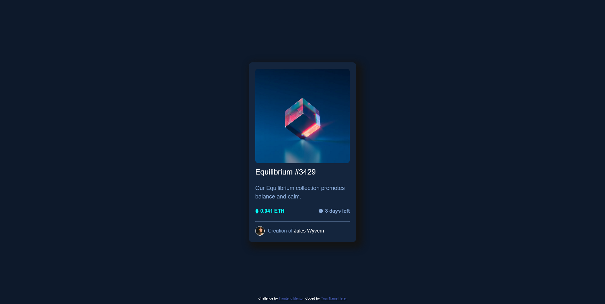

# Frontend Mentor - NFT preview card component solution

This is a solution to the [NFT preview card component challenge on Frontend Mentor](https://www.frontendmentor.io/challenges/nft-preview-card-component-SbdUL_w0U). Frontend Mentor challenges help you improve your coding skills by building realistic projects. 

## Table of contents

- [Overview](#overview)
  - [The challenge](#the-challenge)
  - [Screenshot](#screenshot)
  - [Links](#links)
  - [Built with](#built-with)

## Overview

### The challenge

Users should be able to:

- View the optimal layout depending on their device's screen size
- See hover states for interactive elements

### Screenshot

### Links

- Solution URL: [URL here](https://www.frontendmentor.io/challenges/nft-preview-card-component-SbdUL_w0U/hub/ntf-card-component-08pLmWn7wS)
- Live Site URL: [URL here](https://skolpionek.github.io/NFT_PreviewCardComponent/)

## My process

### Built with

- HTML5 markup
- CSS
- Flexbox
- SCSS/SASS
